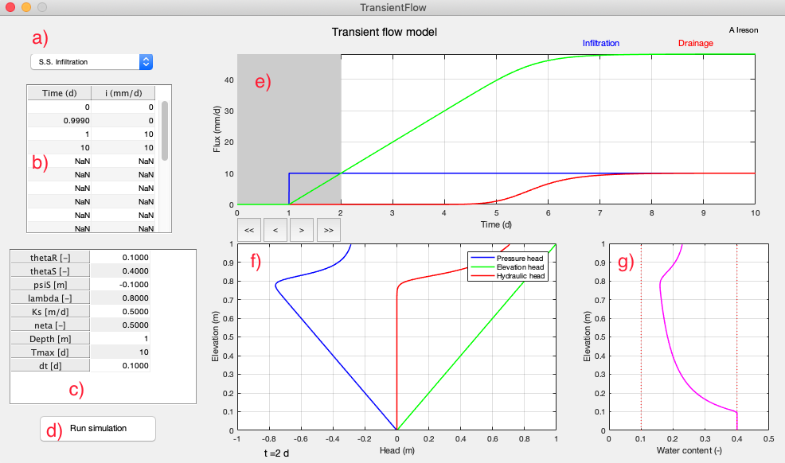

# Transient unsaturated zone flow

Andrew Ireson
Jan. 2019

This MATLAB tool is used to understand how infiltration and evaporation processes affect the soil water content and matric potential in a vertical soil profile.

To use the tool, simply run the m-file. This brings up the user interface/output screen shown here:

a) select from a number of defauly scenarios

b) Define the timeseries input flux at the ground surface. Left hand column is time points, right hand column is flux, with positive numbers indicating downward flow (i.e. infiltration) and negative numbers indicating evaporation.

c) Assign hydraulic parameters for the Brooks and Corey model, as well as the column depth and maximum runtime (which must be less than or equal to the maximum time in b)).

d) Click this button to run the simulation. The initial condition is a hydrostatic profile above a water table.

e) Time series model output. Blue is the upper boundary flux, red is drainage accross the lower boundary, and green is the change in storage.

f) Vertical pressure head (blue), elevation head (green) and hydraulic head (red) profiles, at the time indicated in e) by the left hand extent of the grey area. Use the arrow buttons to change the time.

g) Vertical water content profile, corresponding to f).

